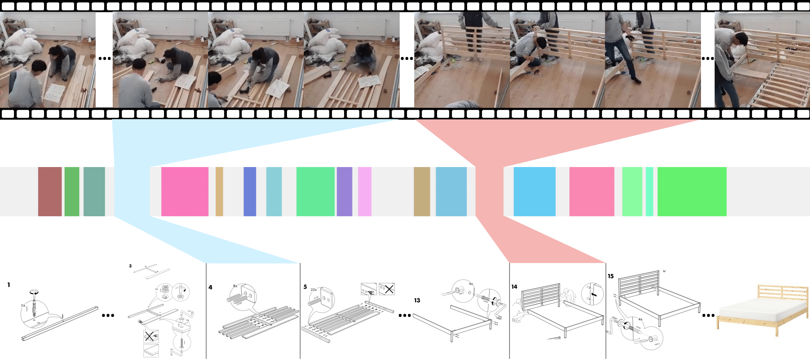

<div align="center">

# IKEA Assembly in The Wild (IAW) Dataset

[](https://iaw.davidz.cn)
[](https://academic.davidz.cn/en/publication/zhang-cvpr-2023/)
[](./LICENSE)



The IKEA Assembly in The Wild (IAW) Dataset consists of 1005 YouTube videos, their corresponding step-by-step manuals, and the manually annotated ground-truth temporal alignment. The entire dataset is available in JSON format with URLs to PDFs and videos, the temporal alignment and we also provide a script to download the files. If you have any questions, please create a GitHub issue or contact [me](mailto:jiahao.zhang@anu.edu.au).

</div>

## Getting Started

```bash
# clone the code, install dependencies
git clone https://github.com/DavidZhang73/IKEAAssemblyInTheWildDataset.git
pip install -r requirements.txt

# sanity check for json schema and url availability
# NOTICE: Some URLs may be unavailable due to the change of IKEA website and YouTube videos.
python sanity_check.py > sanity_check.log

# download the files (manuals and videos)
# NOTICE: This may take a while (denpends on your internet speed), and the total size is around 230GB (~229GB videos + ~1GB manuals).
python get_dataset.py
```

### Dataset file structure

```bash
└── dataset
    ├── IKEAAssemblyInTheWildDataset.json      # dataset json file
    ├── Furniture                              # downloaded files
    │   └── <category>                         # category name, e.g. sofa, bed, wardrobe, table, etc.
    │       └── <furniture_id>                 # furniture id, ikea official identifier
    │           ├── <furniture>.jpg            # furniture image
    │           ├── manual                     # manual files
    │           │   ├── 1                      # pages extracted from pdf1.pdf
    │           │   │   ├── page-1.png
    │           │   │   └── page-2.png
    │           │   ├── 2                      # pages extracted from pdf2.pdf
    │           │   │   ├── page-1.png
    │           │   │   └── page-2.png
    │           │   ├── <pdf1>.pdf             # manual pdf downloaded from ikea
    │           │   └── <pdf2>.pdf
    │           ├── step
    │           │   ├── step-1.png             # step image extracted from pages
    │           │   └── step-2.png
    │           └── video                      # video files
    │               └── <video_id>.mp4         # video downloaded from YouTube
    └── split                                  # dataset splits for the project https://github.com/DavidZhang73/AssemblyVideoManualAlignment
        ├── train.json                         # train split, a subset of the IKEAAssemblyInTheWildDataset.json
        ├── train_clip.csv                     # train split csv file for the Dataloader
        ├── val.json
        └── val_clip.csv
        ├── test.json
        └── test_clip.csv
```

### Anontation JSON schema

The schema is defined in [JSON Schema Format](dataset_schema.json). One example:

```json
[
  {
    "id": "s79011430",
    "name": "KIVIK",
    "category": "Furniture",
    "subCategory": "Sofas",
    "typeName": "Three-seat sofa",
    "pipUrl": "https://www.ikea.com/au/en/p/kivik-three-seat-sofa-orrsta-light-grey-s79011430/",
    "mainImageUrl": "https://www.ikea.com/au/en/images/products/kivik-three-seat-sofa-orrsta-light-grey__0249491_pe387762_s5.jpg",
    "variants": ["s29194408", "s79193755", "s19193678", "s09305582"],
    "manualList": [
      {
        "url": "https://www.ikea.com/au/en/assembly_instructions/kivik-cover-three-seat-sofa-orrsta-light-grey__AA-448712-4.pdf"
      }
    ],
    "annotationList": [
      {
        "manual": 0,
        "page": 3,
        "step": 0,
        "x": 76.58345021037869,
        "y": 464.8021486123546,
        "width": 1063.4656381486675,
        "height": 1081.9212175470009,
        "color": "#4625a7"
      },
      {
        "manual": 0,
        "page": 5,
        "step": 1,
        "x": 76.58345021037869,
        "y": 76.94359892569382,
        "width": 1096.5357643758766,
        "height": 1534.1611459265891,
        "color": "#74cedd"
      },
      {
        "manual": 0,
        "page": 7,
        "step": 2,
        "x": 73.1023842917251,
        "y": 76.94359892569382,
        "width": 1094.7952314165498,
        "height": 1534.1611459265891,
        "color": "#28a802"
      },
      {
        "manual": 0,
        "page": 8,
        "step": 3,
        "x": 81.80504908835904,
        "y": 69.09221128021487,
        "width": 1089.5736325385694,
        "height": 497.7779767233661,
        "color": "#4094e0"
      },
      {
        "manual": 0,
        "page": 8,
        "step": 4,
        "x": 57.43758765778401,
        "y": 661.0868397493285,
        "width": 1106.9789621318373,
        "height": 954.7287376902419,
        "color": "#34c1ba"
      },
      {
        "manual": 0,
        "page": 9,
        "step": 5,
        "x": 87.02664796633941,
        "y": 70.66248880931066,
        "width": 1025.1739130434783,
        "height": 1419.5308863025962,
        "color": "#979c83"
      },
      {
        "manual": 0,
        "page": 10,
        "step": 6,
        "x": 78.32398316970547,
        "y": 75.37332139659803,
        "width": 1087.8330995792426,
        "height": 1534.1611459265894,
        "color": "#af9c4a"
      },
      {
        "manual": 0,
        "page": 11,
        "step": 7,
        "x": 67.88078541374473,
        "y": 69.09221128021487,
        "width": 1080.8709677419356,
        "height": 840.0984780662488,
        "color": "#168120"
      },
      {
        "manual": 0,
        "page": 12,
        "step": 8,
        "x": 73.1023842917251,
        "y": 75.37332139659803,
        "width": 1094.7952314165498,
        "height": 1535.731423455685,
        "color": "#8e53b6"
      },
      {
        "manual": 0,
        "page": 13,
        "step": 9,
        "x": 64.39971949509116,
        "y": 65.95165622202327,
        "width": 1021.6928471248245,
        "height": 816.544315129812,
        "color": "#6ab3c7"
      }
    ],
    "videoList": [
      {
        "url": "https://www.youtube.com/watch?v=mRg8xRj6CD8",
        "title": "IKEA KIVIK sofa Assemble Guide and Review",
        "duration": 649,
        "height": 1080,
        "width": 1920,
        "fps": 15,
        "annotation": [
          { "start": 16.5, "end": 132.9, "action": 0 },
          { "start": 134.6, "end": 249.3, "action": 1 },
          { "start": 250.4, "end": 292.2, "action": 2 },
          { "start": 295.1, "end": 311, "action": 3 },
          { "start": 311.6, "end": 360.4, "action": 4 },
          { "start": 361, "end": 404.5, "action": 5 },
          { "start": 405.7, "end": 461.5, "action": 6 },
          { "start": 462.1, "end": 493.9, "action": 7 },
          { "start": 494.5, "end": 533.3, "action": 8 },
          { "start": 535.6, "end": 574.4, "action": 9 }
        ],
        "people_count": "2",
        "person_view": "thirdPerson",
        "is_fixed": "fixed",
        "is_indoor": "indoor"
      }
    ]
  }
]
```

## Cite

If you find this dataset useful, please cite our paper:

```bibtex
@inproceedings{Zhang2023Aligning,
  author    = {Zhang, Jiahao and Cherian, Anoop and Liu, Yanbin and Ben-Shabat, Yizhak and Rodriguez, Cristian and Gould, Stephen},
  title     = {Aligning Step-by-Step Instructional Diagrams to Video Demonstrations},
  booktitle = {Conference on Computer Vision and Pattern Recognition (CVPR)},
  year      = {2023},
}
```

## License

[MIT](LICENSE)
